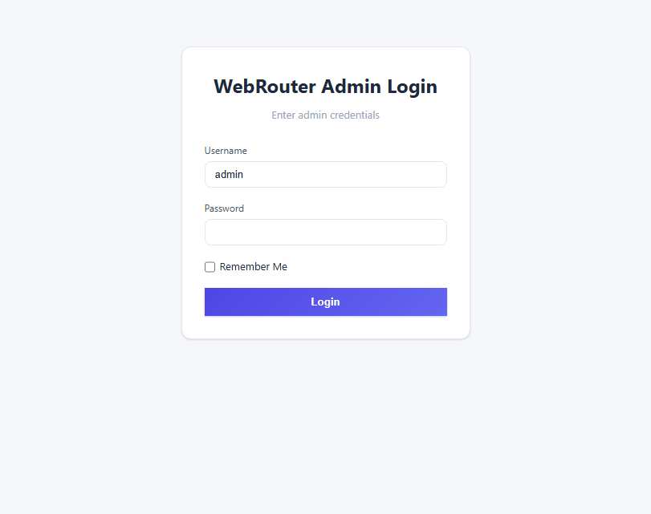
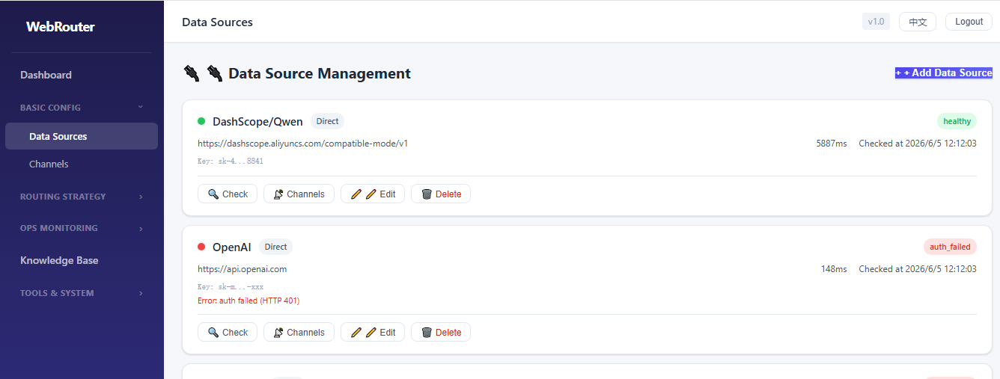
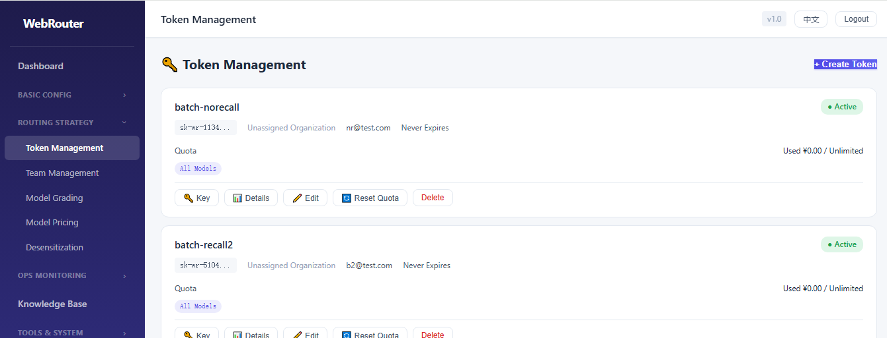
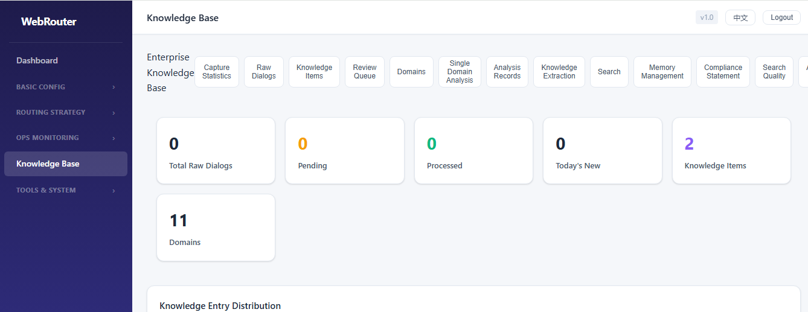
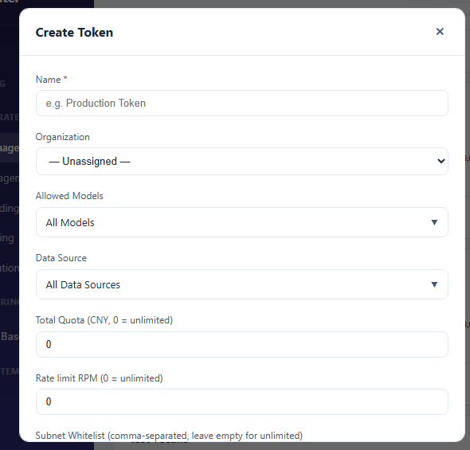

<p align="center">
  
</p>

<p align="center">
  <a href="https://webrouter.tech">
    
  </a>
  <a href="https://webrouter.tech/docs/">
    
  </a>
  <a href="https://demo.webrouter.tech">
    
  </a>
</p>

<h1 align="center">WebRouter</h1>

<p align="center">
  <strong>统一 AI API 网关</strong> — 一个入口管理所有大模型服务<br/>
  一把 Key → OpenAI、Anthropic、Google、DeepSeek、通义千问……
</p>

<p align="center">
  <a href="README.md">English</a> ·
  <a href="#快速开始">快速开始</a> ·
  <a href="#核心功能">核心功能</a> ·
  <a href="#架构">架构</a> ·
  <a href="https://webrouter.tech/docs/">文档</a> ·
  <a href="#许可证">许可证</a>
</p>

<p align="center">
  
  
  
  
  
</p>

---

## 为什么用 WebRouter？

管理多个 AI API 数据源很痛苦——Key 散落各处、成本不可见、上游挂了没感知。WebRouter 提供一个**统一控制面**。

- **受够了到处写 provider URL？** → 一个网关地址，自动路由到最优数据源
- **担心上游宕机？** → 自动健康检测、冷却降级、故障转移
- **不知道花了多少钱？** → 按模型/Token/团队的实时成本追踪与额度管理
- **团队共用 API Key？** → 独立 Token + 配额隔离 + 模型白名单

## 核心功能

### 🧠 智能路由
设置 `model: "auto"`，WebRouter 根据请求复杂度自动选模型——简单请求走经济型，复杂推理走高端模型。

### 💓 健康监控
自动健康检测 + 延迟追踪。失效 Provider 进入冷却，流量自动切换——无需人工干预。

### 💰 成本追踪
按模型、按 Token、按团队的实时成本核算，额度管理 + 预算告警。

### 🔐 隐私脱敏
内置脱敏引擎，请求到达上游前自动剥离手机号、身份证号、邮箱等 PII 信息。

### 👥 团队管理
邀请成员、分配额度、限制模型访问。每人一把独立 Key，权限隔离。

### ⚡ 高性能代理
`wr-proxy` Go 网关负责请求转发、退避重试、流式传输、成本计量——延迟开销极小。

### 📡 多数据源类型
| 类型 | 说明 | 健康 | 延迟 | 成本 |
|------|------|:----:|:----:|:----:|
| `direct` | 官方直连（OpenAI、Anthropic、Google…） | ✅ | ✅ | — |
| `aggregate` | 聚合平台（OhMyGPT、API2D…） | ✅ | ✅ | 手动 |
| `litellm` | LiteLLM 代理 | ✅ | ✅ | — |
| `custom` | 任何 OpenAI 兼容网关 | ✅ | ✅ | — |

### 🔄 对话记忆召回
客户端通过 `@recall` 或 `X-Recall-Session` 请求头，代理自动恢复并注入对话历史——无需手动管理上下文。

### 📚 知识库与 RAG
内置企业级检索增强生成。自动捕获对话内容、通过 LLM 提取结构化知识，将相关上下文注入每次请求。

### ⚡ 成本优化
Token 压缩、会话压缩、动态内容重排序，自动降低上游 Token 消耗并提高 Prompt Cache 命中率。

### 🛠️ CLI 配置导出
一键导出 Claude Code、Codex、Cursor、Continue 等工具的环境变量和配置。

---

## 快速开始

### 在线体验

不想安装？立即访问 **[demo.webrouter.tech](https://demo.webrouter.tech)** 在线体验（账号 `admin` / 密码 `admin123456`）。

### 环境要求

- Python 3.8+
- Go 1.21+（仅从源码编译 wr-proxy 时需要，已含预编译二进制）
- 内存 2 GB+

### 安装并启动

```bash
git clone https://github.com/<org>/webrouter.git
cd webrouter
bash deploy/install.sh
```

安装脚本自动检测系统和架构，创建虚拟环境，安装依赖，启动双进程。

### 打开管理面板

```bash
open http://localhost:5050
# 默认账号：admin / admin123
```

### 添加第一个数据源

1. 进入 **数据源** → **+ 添加**
2. 选择类型 `direct`，填入 OpenAI 的 Base URL 和 API Key
3. 点击 **🔍 检测** 验证连通性
4. 网关已就绪：`http://localhost:5051/v1/chat/completions`

### Docker 部署

```bash
cd webrouter
docker compose -f deploy/docker-compose.yml up -d
```

---

## 文档

完整文档请访问 **[webrouter.tech/docs/](https://webrouter.tech/docs/)**：

| 指南 | 内容 |
|------|------|
| [快速上手](https://webrouter.tech/docs/zh/guide/quick-start) | 快速开始、安装、部署方案 |
| [核心概念](https://webrouter.tech/docs/zh/guide/architecture) | 架构、数据源管理、令牌与团队 |
| [智能路由](https://webrouter.tech/docs/zh/guide/smart-routing) | 自动模型选择、降级策略 |
| [记忆与知识库](https://webrouter.tech/docs/zh/guide/memory-recall) | 会话记忆召回、知识库与 RAG |
| [运维管理](https://webrouter.tech/docs/zh/guide/monitoring) | 监控、告警、计费、脱敏 |
| [API 参考](https://webrouter.tech/docs/zh/guide/api-reference) | 完整 API 文档 |

---

## 产品截图

<p align="center">
  
</p>

<p align="center">
  
</p>

<p align="center">
  
</p>

<p align="center">
  
</p>

<p align="center">
  
</p>

---

## 架构

```
┌─────────────┐     HTTP      ┌─────────────────┐
│  浏览器/CLI  │ ───────────→ │    WebRouter     │
│             │ ←──────────── │    (Flask)       │
└─────────────┘               │    :5050         │
                              └──────┬──────────┘
                                     │
                              ┌──────▼──────┐
                              │  wr-proxy    │
                              │  (Go) :5051  │
                              └──────┬──────┘
                                     │
                     ┌───────────────┼───────────────┐
                     │               │               │
              ┌──────▼──────┐ ┌──────▼──────┐ ┌──────▼──────┐
              │   direct    │ │  aggregate  │ │   custom    │
              │  (官方直连)  │ │  (聚合平台)  │ │ (自定义网关) │
              └─────────────┘ └─────────────┘ └─────────────┘
```

| 组件 | 技术栈 | 职责 |
|------|--------|------|
| **WebRouter**（backend） | Python Flask | 管理面板、REST API、数据模型、定时任务 |
| **wr-proxy** | Go 1.22 | 高性能代理网关：路由、重试、脱敏、计量 |

两个组件共享 SQLite 数据库（也支持 MySQL/PostgreSQL）存取配置和请求日志。

---

## 目录结构

```
webrouter/
├── backend/                # Flask 后端
│   ├── app.py             # 应用入口
│   ├── config.py          # 配置
│   ├── models/            # 数据模型
│   ├── routes/            # 12 个 API 蓝图 (/api/*)
│   ├── services/          # 业务逻辑
│   ├── static/            # 前端 SPA
│   │   ├── index.html
│   │   ├── js/            # 21 个页面模块
│   │   ├── css/
│   │   └── i18n/          # en.json, zh-CN.json
│   └── start.py           # 进程管理器
├── wr-proxy/               # Go 代理网关
│   ├── main.go
│   ├── proxy.go            # HTTP 转发
│   ├── smart_model.go      # 智能路由
│   ├── retry.go            # 退避重试
│   ├── desensitize.go      # 脱敏引擎
│   ├── meter.go            # 成本计量
│   └── ...
├── deploy/                 # 部署配置
│   ├── install.sh
│   ├── Dockerfile
│   ├── docker-compose.yml
│   └── nginx.conf
├── docs/                   # 项目文档
├── data/                   # 运行数据
└── .env                    # 环境配置（自动生成）
```

---

## 配置说明

所有设置通过 `.env` 文件管理（首次安装自动生成）：

| 变量 | 说明 | 默认值 |
|------|------|--------|
| `SESSION_SECRET` | Flask 会话密钥 | 自动生成 |
| `DATABASE_URI` | 数据库连接 | SQLite |
| `REDIS_URL` | Redis 连接（可选，缓存用） | — |
| `FLASK_ENV` | 运行环境 | `production` |
| `FLASK_HOST` | 监听地址 | `0.0.0.0` |
| `FLASK_PORT` | Flask 端口 | `5050` |
| `WR_PROXY_PORT` | wr-proxy 端口 | `5051` |
| `ENABLE_SCHEDULER` | 启用定时健康检测与告警 | `0`（debug 模式关闭） |

### 进程管理

```bash
python3 backend/start.py start     # 启动所有服务
python3 backend/start.py stop      # 停止所有服务
python3 backend/start.py restart   # 重启
python3 backend/start.py status    # 查看状态
python3 backend/start.py logs      # 查看日志
```

也可使用安装时生成的脚本：

```bash
./start.sh    # 启动
./stop.sh     # 停止
```

---

## 路线图

- [ ] **Plugin SDK** — 可扩展插件接口（企业版模块）
- [ ] **SSO / SAML / OIDC** — 企业单点登录
- [ ] **审计日志** — 防篡改操作审计
- [ ] **集群模式** — 多实例共享状态
- [ ] **云托管版** — 零运维托管服务
- [ ] **高级路由 DSL** — 按部门/项目/标签自定义路由规则

> 社区版与企业版功能对比详见 [LICENSING.md](LICENSING.md)。

---

## 参与贡献

欢迎贡献！提交 PR 前：

1. 签署 [贡献者许可协议 (CLA)](CONTRIBUTING.md) — 授予项目再许可权
2. 遵循现有代码风格
3. 本地测试通过

详见 [CONTRIBUTING.md](CONTRIBUTING.md)。

---

## 许可证与版本

WebRouter 提供两个版本。完整对比见[官网价格方案](https://webrouter.tech/#pricing)。

| 功能 | 社区版 | 企业版 |
|------|:-----:|:------:|
| 价格 | 免费 | 定制 |
| 最大并发 | 50 | 可定制 |
| SSO / SAML / OIDC | — | ✅ |
| 集群模式 | — | ✅ |
| 审计日志 | 基础 | 自定义规则 |
| 知识库与 RAG | 基础 | 高级 |
| 协议 | BSL 1.1 → Apache 2.0 (2029) | 专有 EULA |

完整文本见 [LICENSE](LICENSE)，双版策略见 [LICENSING.md](LICENSING.md)。

---

## 致谢

WebRouter 基于以下开源项目构建：

- [Flask](https://flask.palletsprojects.com/) — Python Web 框架
- [modernc.org/sqlite](https://gitlab.com/cznic/sqlite) — 纯 Go SQLite（无 CGO）
- [APScheduler](https://apscheduler.readthedocs.io/) — 任务调度
- [Font Awesome](https://fontawesome.com/) — 图标

---

<p align="center">
  <strong>一个网关，全部 AI API。</strong>
</p>
